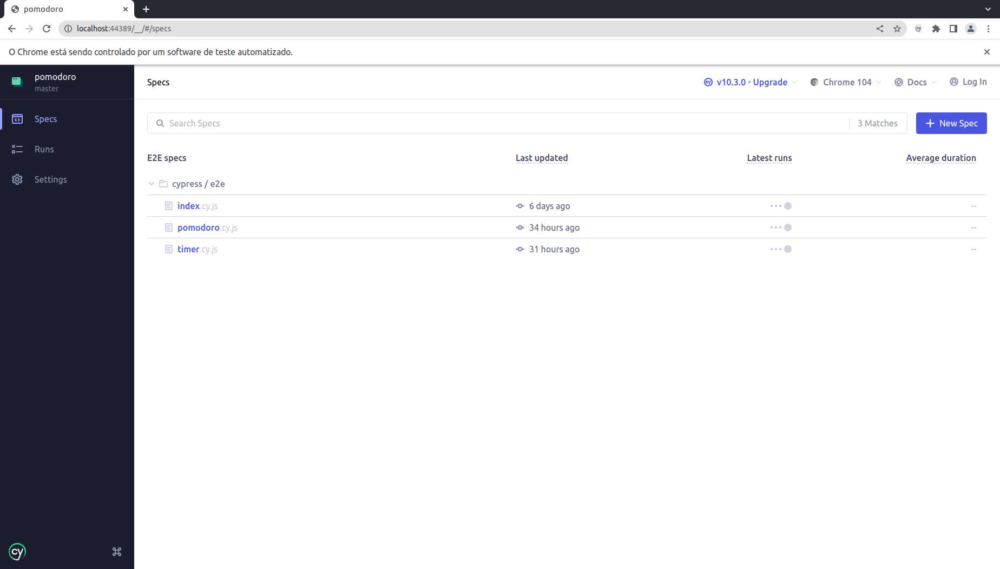
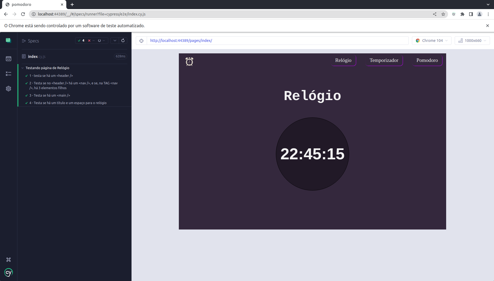

# Bem Vindo ao Projeto My Google!!!

Este é o primeiro projeto com o propósito de ajudar aos iniciantes na programação a começarem a desenvolver um *__Portfólio__*. Também ajudará aos que
desejam pegar novos projetos para praticar e se aperfeiçoarem, estendendo, consequentenmente, ainda mais o Portfólio. </br>
Fique a vontade para pegar os projetos e desenvolver à sua maneira, publicar no LinkedIn, mostrar para rescrutadores e tudo mais.

>*__Obs__*.: __LEIA ATENTAMENTE TODO O `README` ANTES DE COMEÇAR O DESENVOLVIMENTO DO PROJETO, POIS NELE ESTÃO CONTIDAS TODAS AS INFORMAÇÕES NECESSÁRIAS PARA O DESENVOLVIMENTO DO PROJETO.__

---

## Sumário
  - [Requisitos Para Desenvolver Este Projeto](#requisitos-para-desenvolver-este-projeto)
  - [Sobre o Projeto](#sobre-o-projeto)
     - [Tecnologias a Serem Utilizadas](#tecnologias-a-serem-utilizadas)
  - [Durante o Desenvolvimento](#durante-o-desenvolvimento)
     - [Mantendo Seu Código Versionado](#mantendo-seu-código-versionado)
  - [Desenvolvendo o Projeto](#desenvolvendo-o-projeto)
     - [Iniciando o Projeto](#iniciando-o-projeto)
     - [Instalando as Dependências](#instalando-as-dependências)
     - [Rodando os Testes](#rodando-os-testes)
  - [Requisitos do Projeto](#requisitos-do-projeto)
     - [Lista de Requisitos](#lista-de-requisitos)
       - [1 - Crie um Header](#1---crie-um-header)
       - [2 - Crie um Main](#2---crie-um-main)
       - [3 - Crie um Footer](#3---crie-um-footer)
   - [Considerações Finais](#considerações-finais)
---

### Requisitos Para Desenvolver Este Projeto

- VS Code
- NodeJS v14^

Para este projeto você precisa ter instalado em sua máquina um editor de código (sugiro o VS Code pela sua simplicidade e leveza além
de extensões que facilitam muito o desenvolvimento) e o Node na versão 14.0.0 ou superior.

Para saber qual versão do Node está rodando em sua máquina, abra o terminal e execute:

```
node --version
```

Caso precise mudar a versão do Node, uma opção é fazer uso do `NVM` para instalar novas versões e gerenciar as versões do Node em sua máquina.

Para saber se você tem o `NVM` instalado em sua máquina, abra o terminal e execute:

```
nvm --version
```

Você pode aprender mais sobre `NVM` <a href='https://github.com/nvm-sh/nvm'>aqui</a>

---

### Sobre o Projeto

Neste projeto você desenvolverá a tela do Google (ou, pelo menos, uma tela semelhante :sweat_smile:). O objetivo é você desenvolver e consolidar seus
conhecimentos em _HTML_ e _CSS_.

>__Obs.1__: Sinta-se à vontade para desenvolver o projeto bem à sua maneira, com suas características, mas vise sempre manter o código mais limpo e legível
possível. Mantenha a organização de seus códigos.

>__Obs.2__: Na raiz do projeto há um diretório (pasta) chamada *__base_answer__*. Nesta pasta está um exemplo do projeto pronto desenvolvido por mim. A intenção
é de você poder ter um lugar para que possa tirar alguma dúvida. Busque não se debruçar em cima do projeto pronto, tente fazer do seu jeito, pesquise quando
surgir dúvidas, use este exemplo pronto apenas como último recurso.

#### Tecnologias a Serem Utilizadas

- __HTML__
- __CSS__

Fique à vontade para ir além e utilizar bibliotecas como, por exemplo, _Bootstrap_.

---

### Durante o Desenvolvimento

#### Mantendo Seu Código Versionado

Busque fazer pequenos commits a cada nova funcionalidade do projeto implementada. </br>
É uma boa prática de mercado o uso de `commits semânticos`. Caso ainda não conheça esta prática pode começar a ler sobre eles <a href='https://medium.com/linkapi-solutions/conventional-commits-pattern-3778d1a1e657'>aqui</a>

---

### Desenvolvendo o Projeto

#### Iniciando o Projeto

Para dar o primeiro passo você precisa criar um _fork_ do projeto. Assim você estará puxando o projeto do meu repositório para o seu.

>__Obs.1__: Se você ainda não possui conhecimento sobre como o _fork_ funciona, leia <a href='https://docs.github.com/pt/get-started/quickstart/contributing-to-projects'>este guia</a> sobre _fork_ até a seção `Fazendo e enviando por push as alterações`. </br> Você pode ir além nos conhecimentos sobre _fork_ mas não serão necessários para este projeto.

>__Obs.2__: *__NÃO É NECESSÁRIO ABRIR UM PR (Pull Request)!!!__*

Feito o _fork_, clone o repositório para o seu computador

#### Instalando as Dependências

Para iniciar o projeto certifique-se de instalar as dependências.

Abra o seu terminal na raiz do projeto (o terminal do VS Code já abre na pasta que o VS Code foi aberto) e execute o comando:

```
npm install
```

Executado este comando, serão instaladas todas as dependências do projeto.

#### Rodando os Testes

Para os testes de Front-end nós estaremos utilizando o __Cypress__, uma poderosa ferramenta de testes para validação de telas. Ele acessa o código fonte ou URL e verifica, de acordo com os testes implementados, a existência ou não de elementos DOM. </br>
O mais importante aqui é que você saiba como executar estes testes para que possa desenvolver o projeto de acordo com o que se é pedido.

Para começar a testar, com seu terminal aberto na raiz do projeto, execute:

```
npm run cypress:open
```

Aguarde um momento! O Cypress será iniciado (paciência... às vezes demora um pouco mesmo :grimacing:).

Após a inicialização do Cypress abrirá a seguinte tela:

> </br>

Veja que temos 1 arquivo de testes chamado *__my_google.spec.js__*. Clique neste arquivo de testes.

> </br>

A tela mostrada acima é a tela que abrirá executando todos os testes presentes no arquivo *__my_google.spec.js__*

Caso abrir o teste seja a primeira coisa que você faça, abrirá exatamente esta tela mostrada no print acima, pois o _Cypress_ não conseguirá encontrar o arquivo a ser testado (index.html).

> </br>

Conforme você for cumprindo cada requisito, você vai ganhando um *__check__* verde indicando o seu avanço.

---

### Requisitos do Projeto

Faça com calma e atenção. Muito importante a __organização__ de seus códigos.

Ao concluir o projeto, ele deverá estar semelhante ao seguinte print:

> </br>

Mas fique à vontade para adicionar novas funcionalidades, adicionar os ícones de dentro do `<input />`, dentre outras coisas. A imagem acima é apenas um exemplo (o resultado do código da pasta _base_answer_)

---

## ATENÇÂO!
#### OS ARQUIVOS `index.html` e `style.css` (para o arquivo .css o nome não importa), DEVERÃO ESTAR NA RAIZ DO PROJETO PARA QUE OS TESTES SEJAM EXECUTADOS. </br> </br>

#### Lista de Requisitos

### 1 - Crie um `<header />`

Crie um `<header />` que possua 4 elementos.

##### O que será testado/validado?

- Será validado que seu projeto possui uma TAG `<header />`;
- Será validado que a TAG `<header />` possui 4 elementos.

### 2 - Crie um `<main />`

Crie um `<main />` que possua 3 elementos sendo eles uma imagem, um input do tipo texto e uma TAG `<section />`. A TAG `<section />`, por sua vez, deve possuir mais 2 elementos.

##### O que será validado?

- Será validado que seu projeto possui uma TAG `<main />`;
- Será validado que a TAG `<main />` possui 3 elementos;
- Será validado que um destes 3 elementos é uma `<section />`;
- Será validado que a TAG `<section />` possui 2 elementos.

### 3 - Crie um `<footer />`

Este requisito é mais extenso e confuso, por conta disto, estarei "dividindo em 3 partes"

>Este requisito é um pouco mais complexo devido a quantidade de informações. Leia-o com calma e atenção. Se necessário, envie suas dúvidas em nosso Discord para que possamos esclarecer com mais tranquilidade.

#### 3.1 - Crie um `<footer />` que possua 1 elemento `<section />`

#### 3.2 - Esta `<section />`, por sua vez, deve possuir 2 elementos.

#### 3.3 - O segundo elemento desta `<section />` deve possuir, exatamente, a classe `footer-links` (`class="footer-links"`) que deve possuir 2 elementos filhos.

#### 3.4 - O primeiro elemento filho do elemento com a classe `footer-links` deve possuir o atributo `id="links-for-google"`. Este elemento deve possuir, também, 4 elementos filhos.

#### 3.5 - O segundo elemento filho do elemento com a classe `footer-links` deve possuir o atributo `id="links-for-you"`. Este elemento deve possuir, também, 3 elementos filhos.

##### O que será validado?

- Será validado que seu projeto possui uma TAG `<footer />`;
- Será validado que a TAG `<footer />` possui 1 elemento e que este seja uma TAG `<section />`;
- Será validado que a TAG `<section />` possui 2 elementos;
- Será validado que o segundo elemento da TAG `<section />` possui o atributo `class="footer-links"` e 2 elementos filhos;
- Será validado que o primeiro elemento filho do elemento com a classe `footer-links` possui o atributo `id="footer-links"` e 4 elementos filhos;
- Será validado que o segundo elemento filho do elemento com a classe `footer-links` possui o atributo `id="links-for-you"` e 3 elementos filhos.

---

### Considerações Finais

Parabéns por chegar até aqui e concluir este que é o primeiro projeto de muitos que ainda virão por aí!!!


## Muito obrigado pelo seu voto de confiança!

Acesse o nosso grupo do Discord para se manter atualizado com relação a novos projetos, interagir comigo e com outras pessoas, tirar suas dúvidas e ajudar outros colegas.

Link para o Discord: https://discord.gg/KN4uxuaYg6
